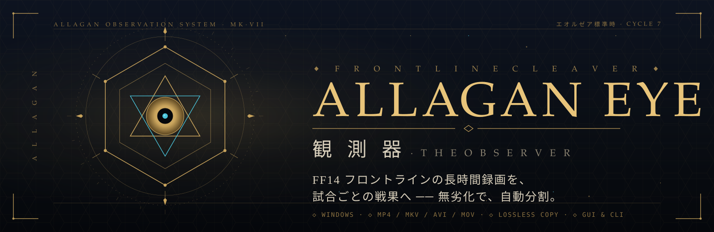
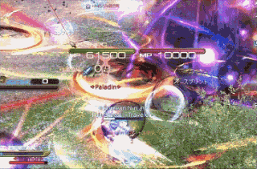
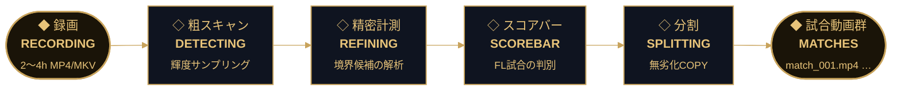
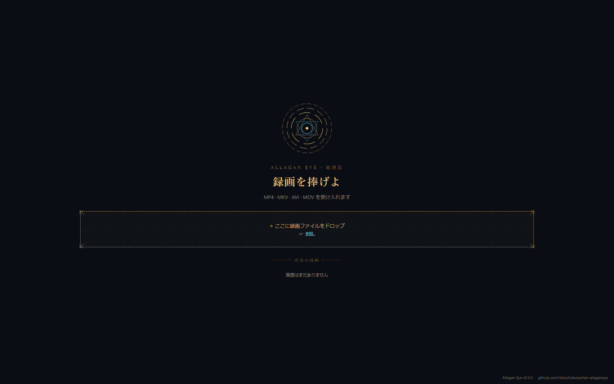
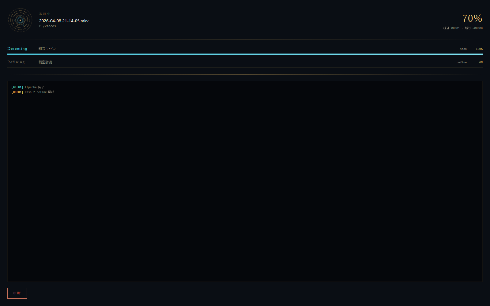
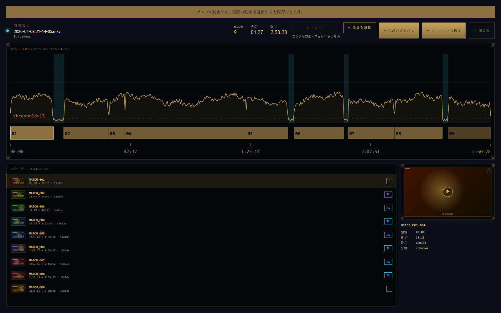
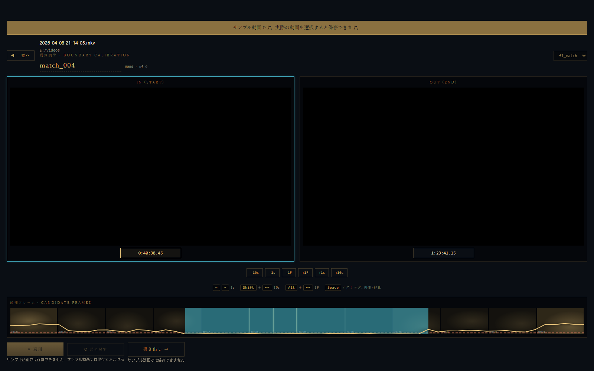
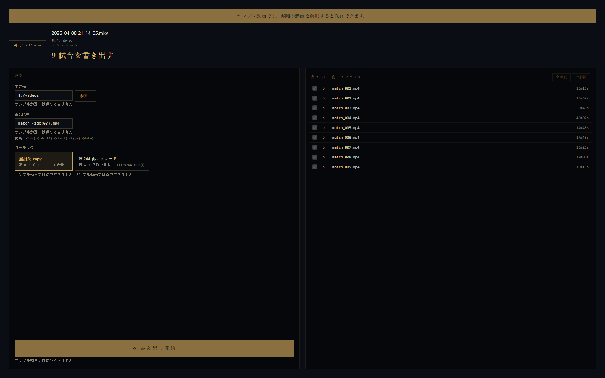

<!-- markdownlint-configure-file
{
  "MD033": {
    "allowed_elements": ["a", "b", "br", "code", "details", "div", "h3", "i", "img", "p", "sub", "summary", "table", "td", "tr"]
  }
}
-->
<!-- =============================================================== -->
<!--  ALLAGAN  EYE   ·   観測器                                       -->
<!--  README rendered in the Allagan-style of the GUI.                -->
<!--  Visual assets live in  image/ at the repo root.                  -->
<!--                                                                  -->
<!--  Lint policy: this README is an intentional design document      -->
<!--  using HTML for layout (table / div / details / img-with-attr).  -->
<!--  MD033 allowed_elements above whitelists exactly the elements    -->
<!--  used by the Allagan-style design. Any other inline HTML still   -->
<!--  fails the lint. Per docs/markdownlint-guide.md §"意図的な書き方".-->
<!-- =============================================================== -->

  

  
  
  
  

  <i>古代アラガン文明の観測眼が、汝の長時間録画を読み解く。</i> 
  <b>OBSなどで録画した数時間の動画を、試合の切れ目を自動検知し、無劣化MP4へ分割します。</b>

 

<b>◇&nbsp;&nbsp;観 測 対 象&nbsp;&nbsp;·&nbsp;&nbsp;O B S E R V A T I O N&nbsp;&nbsp;T A R G E T&nbsp;&nbsp;◇</b>

<i>──&nbsp;&nbsp;幾時間にも及ぶフロントラインの戦果を、観測眼は逃さず読み取る&nbsp;&nbsp;──</i>

 

  

 

## ◆&nbsp;&nbsp;クイックスタート&nbsp;&nbsp;·&nbsp;&nbsp;Q U I C K&nbsp;&nbsp;S T A R T

<table align="center" width="100%">
<tr>
<td width="33%" valign="top" align="center">
<h3>❶</h3>
<b>取得</b> 
D O W N L O A D
  
<a href="https://github.com/Idios/kobutachan-allaganeye/releases/latest"><b><code>allaganeye-*-windows.zip</code></b></a> 
を <a href="https://github.com/Idios/kobutachan-allaganeye/releases/latest">Releases</a> から取得
</td>
<td width="33%" valign="top" align="center">
<h3>❷</h3>
<b>展開</b> 
U N P A C K
  
ZIP をデスクトップなどに展開 
Python/FFmpeg は不要 — ZIP に同梱済
</td>
<td width="33%" valign="top" align="center">
<h3>❸</h3>
<b>観測</b> 
O B S E R V E
  
動画を <code>allaganeye.bat</code> へ 
<b>ドラッグ&amp;ドロップ</b> 
または <code>.bat</code> をダブルクリックで GUI 起動
</td>
</tr>
</table>

出力先: D&amp;D 時は <code>allaganeye-*\output\</code>、GUI 時は画面上で指定（既定は動画と同じフォルダ）。&nbsp;&nbsp;◆&nbsp;&nbsp;詳細手順は <a href="docs/quickstart.md">Quick Start Guide</a> へ。

> [!WARNING]
> **SmartScreen / `.bat` 警告が出る場合** 
> 署名なし配布のため、初回起動時に Windows のセキュリティ警告が表示されることがあります。対処は [Quick Start Guide §3 — セキュリティ警告が出た場合](docs/quickstart.md#3-セキュリティ警告が出た場合) を参照。

 

  

 

## ◆&nbsp;&nbsp;観測の流れ&nbsp;&nbsp;·&nbsp;&nbsp;W O R K F L O W

数時間の録画は、4 つの観測フェーズを経て、試合ごとの戦果へと変換されます。

 

### 5 つの観測フェーズ

<table align="center">
<tr>
<td width="50%" valign="top" align="center">
  
   
  <b>① インポート&nbsp;&nbsp;·&nbsp;&nbsp;D R O P</b> 
  録画ファイルを観測眼に捧げる。直近の録画一覧から再検知も可能。
</td>
<td width="50%" valign="top" align="center">
  
   
  <b>② 検知中&nbsp;&nbsp;·&nbsp;&nbsp;D E T E C T I N G</b> 
  粗スキャン (Detecting) → 精密計測 (Refining、scorebar 分類含む) の 2 フェーズをバーとライブログでリアルタイム表示。
</td>
</tr>
<tr>
<td width="50%" valign="top" align="center">
  
   
  <b>③ 一覧&nbsp;&nbsp;·&nbsp;&nbsp;M A T C H E S</b> 
  輝度タイムライン上に検知結果。試合ごとのサムネとプレビューを並べてレビュー。
</td>
<td width="50%" valign="top" align="center">
  
   
  <b>④ 境界調整&nbsp;&nbsp;·&nbsp;&nbsp;P R E V I E W</b> 
  IN/OUT 2画面 + 候補フレームストリップ + 微細タイムライン。秒・フレーム単位で微調整。
</td>
</tr>
<tr>
<td colspan="2" valign="top" align="center">
  
   
  <b>⑤ 書き出し&nbsp;&nbsp;·&nbsp;&nbsp;E X P O R T</b> 
  ffmpeg で試合動画を生成。無劣化 COPY / H.264 再エンコード・命名規則・出力先を選択可能。
</td>
</tr>
</table>

 

  

 

## ◆&nbsp;&nbsp;特徴&nbsp;&nbsp;·&nbsp;&nbsp;F E A T U R E S

<table align="center">
<tr>
<td width="25%" valign="top" align="center">
<h3>◇</h3>
<b>無劣化分割</b> 
L O S S L E S S&nbsp;&nbsp;C O P Y
  
ffmpeg の stream copy で 再エンコードなし・高速
</td>
<td width="25%" valign="top" align="center">
<h3>◇</h3>
<b>自動境界検知</b> 
A U T O&nbsp;&nbsp;B O U N D A R Y
  
輝度 + スコアバーの 二段判定で誤検知を低減
</td>
<td width="25%" valign="top" align="center">
<h3>◇</h3>
<b>GUI &amp; CLI</b> 
D U A L&nbsp;&nbsp;I N T E R F A C E
  
D&amp;D で気軽に、 CLI で大量バッチも
</td>
<td width="25%" valign="top" align="center">
<h3>◇</h3>
<b>同梱配布</b> 
P O R T A B L E&nbsp;&nbsp;Z I P
  
Python / FFmpeg は ZIP に同梱・インストール不要
</td>
</tr>
</table>

 

  

 

## ◆&nbsp;&nbsp;対応プラットフォーム&nbsp;&nbsp;·&nbsp;&nbsp;P L A T F O R M

> [!IMPORTANT]
> **Windows 専用**です。Python や FFmpeg の事前インストールは必要ありません — Portable ZIP に同梱されています。

 

  

 

## ◆&nbsp;&nbsp;ドキュメント&nbsp;&nbsp;·&nbsp;&nbsp;C O D E X

<table align="center" width="100%">
<tr>
<td width="50%" valign="top">

### ◇&nbsp;&nbsp;一般ユーザー向け

F O R &nbsp; U S E R S

| | |
| --- | --- |
| 📖 | [**Quick Start Guide**](docs/quickstart.md) Portable ZIP の使い方・SmartScreen 警告・トラブルシュート |
| 🎚️ | [**パラメータ調整ガイド**](docs/tuning-guide.md) 分割結果が期待と異なるときのチューニング |
| 🐛 | [**バグ報告ガイド**](docs/bug-report-guide.md) Issue の書き方とログ添付 |

</td>
<td width="50%" valign="top">

### ◇&nbsp;&nbsp;開発者向け

F O R &nbsp; D E V E L O P E R S

| | |
| --- | --- |
| ⚙️ | [**Developer Setup**](docs/developer-setup.md) Git / Python / venv でソースから起動 |
| 🏛️ | [**System Architecture**](docs/system-architecture.md) CLI + GUI + installer の全体構成 (#527) |
| 🖥️ | [**GUI UI Architecture**](docs/ui-architecture.md) L2a Tauri GUI の screen / phase state machine |

</td>
</tr>
</table>

<b>◇&nbsp;&nbsp;すべての設計ドキュメントを表示</b>&nbsp;&nbsp;(specs · design · release)

 

| カテゴリ | ドキュメント |
| --- | --- |
| **CLI / API** | [CLI コマンド仕様](docs/cli-spec.md) · [metadata.json 仕様](docs/metadata-spec.md) · [出力仕様マトリクス](docs/output-spec.md) |
| **設計** | [システム設計概要](docs/design-overview.md) · [動画処理設計](docs/video-processing.md) · [スコアバー検出設計](docs/scorebar-detection-design.md) |
| **リリース** | [リリース戦略・手順](docs/release-process.md) · [バージョニング](docs/versioning.md) |
| **品質** | [テストガイド](docs/testing-guide.md) · [L1 品質基準](docs/l1-quality-criteria.md) · [L2 E2E チェックリスト](docs/l2-e2e-checklist.md) |
| **その他** | [コーディング規約](docs/coding-conventions.md) · [a11y ポリシー](docs/a11y-policy.md) · [ベンチマーク](docs/benchmarks.md) |

 

  

 

## ◆&nbsp;&nbsp;ライセンス&nbsp;&nbsp;·&nbsp;&nbsp;L I C E N S E

[**MIT License**](LICENSE) — 自由に使用・改変・再配布できます。

 

---

  
     
     
    <b>ALLAGAN&nbsp;EYE&nbsp;·&nbsp;観測器</b> 
    An observation system from the lost Allagan civilization. 
    FINAL&nbsp;FANTASY&nbsp;XIV は株式会社スクウェア・エニックスの登録商標です。本ツールは非公式の有志ツールです。
  

