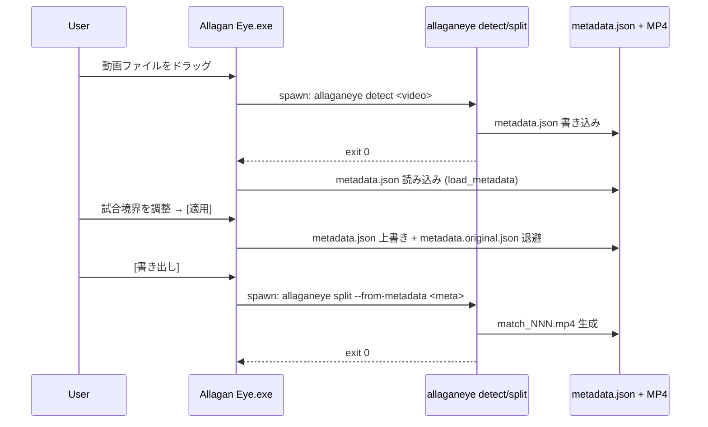

# Allagan Eye — System Architecture

本 doc は Allagan Eye の CLI / GUI / installer がどう組み合わさって動作するかを記録する。個別の詳細仕様は以下に分かれている:

- [CLI コマンド仕様](cli-spec.md) — `allaganeye` のサブコマンド / オプション
- [GUI UI Architecture](ui-architecture.md) — L2a Tauri GUI の screen / phase state machine (Phase 2 基盤、Phase 3/4 で拡張)
- [metadata.json 仕様](metadata-spec.md) — CLI ↔ GUI の唯一の契約
- [リリース戦略](release-strategy.md) — develop-x.x.x / main のブランチ運用

本 doc は上記を横断する「全体像」と「起動経路 (CUI/GUI dispatch)」を扱う。

## 1. コンポーネント構成

```text
┌──────────────────────────────────────────────────────────────────┐
│ Allagan Eye                                                     │
│                                                                  │
│  L2b: Portable ZIP / Tauri bundle (配布形態)                    │
│  ├── allaganeye.bat              ── CLI 起動 (Python ランタイム) │
│  └── Allagan Eye.exe (future)    ── GUI 起動 (Tauri bundle)      │
│       │                                                           │
│       └─ subprocess spawn ─► allaganeye.exe / allaganeye.bat     │
│                                                                   │
│  L1: CLI (`allaganeye`, Python)                                  │
│  ├── detect  ── metadata.json 生成 (ffmpeg / OpenCV)             │
│  ├── split   ── metadata.json 生成 + MP4 分割                   │
│  └── split --from-metadata ── metadata.json 読み込み + 分割     │
│                                                                   │
│  L2a: GUI (`Allagan Eye`, Tauri 2 + React 19)                    │
│  ├── Zustand store ── metadata.json の in-memory 編集            │
│  ├── axum 局所 HTTP サーバ ── <video> 再生用 (Rust 内 thread)    │
│  └── tokio::process ── CLI を subprocess として呼び出し        │
└──────────────────────────────────────────────────────────────────┘
```

- **CLI (L1)** は standalone 動作し、GUI に依存しない
- **GUI (L2a)** は CLI を subprocess として呼び出して detect / split を実行する
- **Installer (L2b)** は両者を同梱する配布形態を提供する
- **metadata.json** が CLI ↔ GUI の唯一の契約 ([metadata-spec.md](metadata-spec.md) #463)

## 2. 起動経路 (CUI / GUI dispatch)

Allagan Eye は **別 exe 方式**を採用する (2026-04-23 確定、#527)。単一バイナリに CLI / GUI の両モードを同居させる設計は採用しない。

### 2.1 配布物と起動コマンド

| 起動ターゲット | 起動方法 | 実体 | 状態 |
|---|---|---|---|
| `allaganeye.bat` (Portable ZIP) | Cmd / PowerShell で引数付き実行 | 同梱 Python + `python -m allaganeye` | リリース済み (v0.1.1) |
| `allaganeye` (Python venv 内) | `python -m allaganeye <cmd>` | pyproject.toml の console_scripts | 開発時 |
| `Allagan Eye.exe` (Tauri bundle) | ダブルクリック / start menu | Tauri 2 ランタイム | 将来 (現在 `tauri.conf.json` の `bundle.active = false`) |

### 2.2 判断根拠

- **ユーザー体験**: ダブルクリックで GUI が立ち上がるのは一般的な Windows アプリの感覚。CLI が混ざると「シェル出力を期待した」「GUI が出てほしい」の混乱が起きる
- **Portable ZIP との整合**: `allaganeye.bat` は既存の Python ランタイム呼び出しラッパ。Windows Defender / SmartScreen で弾かれる運用課題が `.bat` 経由で抽象化済み (#507)
- **bundle の独立性**: Tauri bundle は別 `.exe` なので、CLI の `.bat` と衝突しない。将来 MSIX 等のパッケージ化でも両者を並列同梱可能
- **開発工数**: 単一バイナリ化するには Rust 側に Python interpreter embedding が必要。実質的に別実装と同等のコストで benefit が薄い

### 2.3 GUI → CLI subprocess 経路

GUI は以下のタイミングで CLI を subprocess として呼び出す (本仕様は Phase 3/4 の本物化で `tokio::process::Command` で実装される):

| GUI 画面 | subprocess 引数 | 生成物 | 実装 PR |
|---|---|---|---|
| DetectingScreen (本物化予定) | `allaganeye detect <video> -o <output>` | metadata.json | [#465](https://github.com/Idios/kobutachan-allaganeye/issues/465) Phase 3 |
| ExportScreen (本物化予定) | `allaganeye split --from-metadata <meta>` | metadata.json + MP4 | [#466](https://github.com/Idios/kobutachan-allaganeye/issues/466) Phase 4 |

ExportScreen の H.264 再エンコード時のエンコーダ選択 (#591) は subprocess 経路を使わない。 detect/split が metadata.json `system_info.gpu_vendors_available` に probe 結果を保存しているので、GUI 起動時はその値を `select_h264_encoder_for_export` Tauri command (Rust 内純関数) に渡して NVENC / QSV / AMF / libx264 を解決する。GPU 初期化失敗時のみ `export_match` 内で libx264 fallback retry が走る (CLI 呼び出しなし)。

spawn された CLI プロセスは `ProcessMap` (Rust side、#523) に登録される。ユーザーがウィンドウを閉じる (`×`) 前にプロセスが走っていれば、GUI 側が `kill_tracked_processes` で中断する ([ui-architecture.md §ffmpeg 実行中の中断フロー](ui-architecture.md))。

### 2.4 GUI 内の video 配信 (subprocess ではない)

preview 画面での `<video>` 再生には axum ベースの局所 HTTP サーバ (#465) が使われる。これは **subprocess ではなく Rust プロセス内の async task** で、token ベースの path allowlisting で 127.0.0.1 にのみ bind する。ffmpeg は呼ばず (ブラウザの native decode)、Range リクエストに対応する。

詳細: [ui-architecture.md §video playback](ui-architecture.md) / `gui/src-tauri/src/lib.rs` の `register_video` / `serve_video`。

## 3. データフロー

### 3.1 detect → preview → export の典型フロー



### 3.2 ファイル配置 (実行時)

```text
<output_dir>/
├── metadata.json                     # CLI ↔ GUI 契約 (#463)
├── metadata.original.json            # GUI 初回 [適用] でバックアップ (#516)
├── metadata.draft.json               # GUI 編集中の自動保存 (#517, オプション)
├── match_001.mp4
├── match_002.mp4
└── .detection_cache.json             # CLI の内部キャッシュ (再実行高速化)
```

`~/.allaganeye/cache/<video_hash>/thumbs/*.webp` は GUI のサムネイルキャッシュ (#465)。出力ディレクトリとは別。

## 4. 責務分離の原則

| 原則 | 理由 |
|---|---|
| **CLI は GUI に依存しない** | CLI 単体で実行 / テストできる。CLI のユニットテストで GUI 関連 subprocess は不要 |
| **GUI は CLI を subprocess として呼び出す** | 重いロジック (ffmpeg / 検知) は CLI に集約。GUI 本体は UI に集中 |
| **metadata.json を唯一の契約にする** | GUI と CLI が直接プロセス間通信 (IPC / RPC) しない。ファイルベースで疎結合 |
| **axum video server は GUI 内の async task** | subprocess でも外部サービスでもない。GUI プロセス終了時に自動で畳まれる |
| **プライバシー・セキュリティは CLI 側** | 動画ファイルの検査 (allaganeye-guard) は独立ツール (#454 運用連携のみ、GUI 未統合) |

## 5. 変更時の影響範囲

新機能を追加する際の判断基準:

- **metadata.json のスキーマ変更** → [metadata-spec.md §schema_version](metadata-spec.md) の migration policy に従う (#515)
- **CLI の新サブコマンド** → [cli-spec.md](cli-spec.md) 更新 / GUI が spawn するなら本 doc §2.3 にも行追加
- **GUI の新画面** → [ui-architecture.md §screen 遷移図](ui-architecture.md) の Mermaid 図更新
- **起動経路の変更** (例: `Allagan Eye.exe` を別アーキでビルド) → 本 doc §2 の表を更新
- **bundle 形態の変更** (例: MSIX 採用) → リリース戦略 ([release-strategy.md](release-strategy.md)) と本 doc §2.1 を同時更新

## 6. 関連 issue / doc

- [#527](https://github.com/Idios/kobutachan-allaganeye/issues/527) 本 doc の起票元 (GUI 限定性明記 + dispatch 仕様文書化)
- [#463](https://github.com/Idios/kobutachan-allaganeye/issues/463) Phase 1 data layer (metadata.json 契約)
- [#465](https://github.com/Idios/kobutachan-allaganeye/issues/465) Phase 3 preview 本物化 (axum video server + subprocess 経路)
- [#523](https://github.com/Idios/kobutachan-allaganeye/issues/523) ffmpeg 実行中の安全な中断 (ProcessMap)
- [#466](https://github.com/Idios/kobutachan-allaganeye/issues/466) Phase 4 export 本物化 (subprocess 経路の本格利用)
- [#451](https://github.com/Idios/kobutachan-allaganeye/issues/451) / [#452](https://github.com/Idios/kobutachan-allaganeye/issues/452) L2b installer (bundle 形態 / 配布)
- [cli-spec.md](cli-spec.md) / [ui-architecture.md](ui-architecture.md) / [metadata-spec.md](metadata-spec.md) / [release-strategy.md](release-strategy.md)
