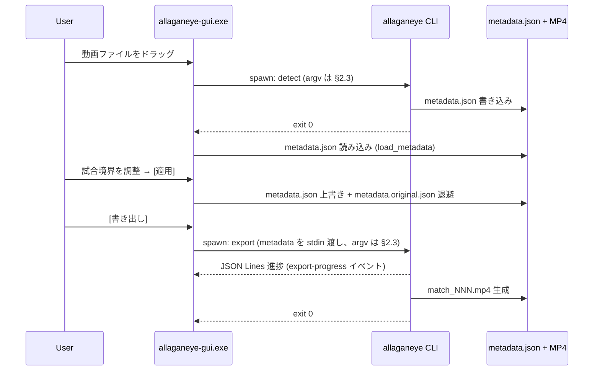

# Allagan Eye — System Architecture

本 doc は Allagan Eye の CLI / GUI / installer がどう組み合わさって動作するかを記録する。個別の詳細仕様は以下に分かれている:

- [CLI コマンド仕様](cli-spec.md) — `allaganeye` のサブコマンド / オプション
- [GUI UI Architecture](ui-architecture.md) — L2a Tauri GUI の screen / phase state machine (Phase 2 基盤、Phase 3/4 で拡張)
- [Tauri Commands リファレンス](tauri-commands.md) — `gui/src-tauri/src/lib.rs` 内の全 `#[tauri::command]` 一覧 (signature + 想定エラー + AppError code 推奨)
- [metadata.json 仕様](metadata-spec.md) — CLI ↔ GUI の唯一の契約
- [リリース戦略](release-process.md) — develop-x.x.x / main のブランチ運用

本 doc は上記を横断する「全体像」と「起動経路 (CUI/GUI dispatch)」を扱う。

## 1. コンポーネント構成

```text
┌──────────────────────────────────────────────────────────────────┐
│ Allagan Eye                                                     │
│                                                                  │
│  L2b: Portable ZIP / Tauri bundle (配布形態)                    │
│  ├── allaganeye.bat              ── 引数なし: GUI / 引数あり: CLI │
│  └── allaganeye-gui.exe          ── GUI 起動 (Tauri bundle, v0.2.0+) │
│       │                                                           │
│       └─ subprocess spawn ─► allaganeye.exe / allaganeye.bat     │
│                                                                   │
│  L1: CLI (`allaganeye`, Python)                                  │
│  ├── detect  ── metadata.json 生成 (ffmpeg / OpenCV)             │
│  ├── split   ── metadata.json 生成 + MP4 分割                   │
│  ├── split --from-metadata ── metadata.json 読み込み + 分割     │
│  ├── export  ── metadata.json から並列 H.264/copy 書き出し (#761) │
│  └── minimap ── エリアマップ切抜き (--region crop / 提案)       │
│                                                                   │
│  L2a: GUI (`Allagan Eye`, Tauri 2 + React 19)                    │
│  ├── Zustand store ── metadata.json の in-memory 編集            │
│  ├── axum 局所 HTTP サーバ ── <video> 再生用 (Rust 内 thread)    │
│  └── tokio::process ── CLI を subprocess として呼び出し        │
└──────────────────────────────────────────────────────────────────┘
```

- **CLI (L1)** は standalone 動作し、GUI に依存しない
- **GUI (L2a)** は CLI を subprocess として呼び出す (呼び出し口の一覧は [§2.3](#23-gui--cli-subprocess-経路) が正。本節では列挙しない)
- **Installer (L2b)** は両者を同梱する配布形態を提供する
- **metadata.json** が CLI ↔ GUI の唯一の契約 ([metadata-spec.md](metadata-spec.md) #463)

## 2. 起動経路 (CUI / GUI dispatch)

Allagan Eye は **別 exe 方式**を採用する (2026-04-23 確定、#527)。単一バイナリに CLI / GUI の両モードを同居させる設計は採用しない。

### 2.1 配布物と起動コマンド

| 起動ターゲット | 起動方法 | 実体 | 状態 |
| --- | --- | --- | --- |
| `allaganeye.bat` 引数なし (Portable ZIP) | ダブルクリック | `start "" allaganeye-gui.exe` で GUI 起動 (CLI-only ZIP 時はヘルプ表示にフォールバック) | v0.2.0 で対応 (#617) |
| `allaganeye.bat` 引数付き (Portable ZIP) | Cmd / PowerShell で `allaganeye.bat <subcommand>` または動画ドラッグ | PyInstaller frozen CLI `allaganeye\allaganeye.exe` (v0.3.0+ #752。v0.2.x までは同梱 Python + `python -m allaganeye`) | リリース済み (v0.1.1) |
| `allaganeye` (Python venv 内) | `python -m allaganeye <cmd>` | pyproject.toml の console_scripts | 開発時 |
| `allaganeye-gui.exe` (Tauri bundle) | ダブルクリック / start menu | Tauri 2 ランタイム | v0.2.0 で対応 (#570)。Portable ZIP に同梱、`tauri.conf.json` の `bundle.active = false` のまま `.exe` 単体を生成し `scripts/build-portable-zip.ps1` で `allaganeye-gui.exe` をそのまま payload にコピー (リネームなし、Cargo binary 名を直接使用)。productName "Allagan Eye" は Tauri のウィンドウタイトルにのみ使われる。NSIS / MSI installer は現バージョンでは生成しない |

### 2.2 判断根拠

- **ユーザー体験**: ダブルクリックで GUI が立ち上がるのは一般的な Windows アプリの感覚。CLI が混ざると「シェル出力を期待した」「GUI が出てほしい」の混乱が起きる
- **Portable ZIP との整合**: `allaganeye.bat` は引数なし (ダブルクリック) で `allaganeye-gui.exe` を `start` 起動する GUI launcher、引数付きで CLI を呼ぶラッパとして dual 役割 (v0.2.0+ #617)。v0.2.x までは `python -m allaganeye` 経由で Python ランタイムを呼んでいたが、v0.3.0 (#752) 以降は PyInstaller frozen CLI (`allaganeye\allaganeye.exe`) を直接呼ぶ形に変わった (bat 内部実装の変更は Rust 側から不可視、§2.6 参照)。Windows Defender / SmartScreen で弾かれる運用課題が `.bat` 経由で抽象化済み (#507)
- **bundle の独立性**: Tauri bundle は別 `.exe` なので、CLI の `.bat` と衝突しない。将来 MSIX 等のパッケージ化でも両者を並列同梱可能
- **開発工数**: 単一バイナリ化するには Rust 側に Python interpreter embedding が必要。実質的に別実装と同等のコストで benefit が薄い

### 2.3 GUI → CLI subprocess 経路

GUI は以下のタイミングで CLI を subprocess として呼び出す (`tokio::process::Command` で実装済み)。

**本表が GUI → CLI 呼び出し口の正 (SSoT) であり、網羅である。**他節・他 doc は呼び出し口の一覧と argv を再掲せず本表を参照すること (#818 の doc SSoT 規約を doc 内の列挙にも適用。同じ列挙が複数箇所にあると、そのたびに片方だけ古くなる余地が生まれるため)。個別の呼び出しに言及すること自体は妨げないが、その場合も argv 全体は書かず本表に委ねる。

argv 列の各行には末尾に `gui/src-tauri/src/lib.rs` 側の argv 構築関数名を括弧書きで添える。argv を変更したときにどの行を直すべきかが一意に決まり、突合先が行ごとに固定されるため。`[...]` は条件付きで付く引数を表す。

網羅性の根拠は `gui/src-tauri/src/lib.rs` で CLI (`cmd_spec.program`) を spawn する箇所が以下 5 つに限られること: `start_detect` / `enumerate_h264_encoders` / `start_export` / `start_minimap` / `detect_minimap_regions`。ffprobe / ffmpeg / explorer.exe を Rust から直接 spawn する経路 (サムネイル生成・フォルダを開く等) は CLI 呼び出しではないため本表の対象外 (プロセス木と孤児対策の観点での spawn 一覧は [process-tree-orphan-audit.md](process-tree-orphan-audit.md) が別途持つ)。

| GUI 画面 | subprocess 引数 | 生成物 | 実装 PR |
| --- | --- | --- | --- |
| DetectingScreen | `allaganeye detect <video> -o <output> --progress-format json [--blackout-threshold V] [--min-blackout-duration V] [--min-match-duration V] [--workers N] [--no-audio] [--no-cache] [--gpu` or `--no-gpu] [--gpu-vendor V]` (`detect_command_args`) | metadata.json | [#465](https://github.com/Idios/kobutachan-allaganeye/issues/465) Phase 3 / [#569](https://github.com/Idios/kobutachan-allaganeye/issues/569) |
| ExportScreen | `allaganeye export --stdin --json --output-dir <dir> --codec <codec> --name-pattern <pat> [--exclude i,j]` (`start_export`。metadata は positional ではなく stdin で渡す) | MP4 (per match) | [#466](https://github.com/Idios/kobutachan-allaganeye/issues/466) Phase 4 / [#761](https://github.com/Idios/kobutachan-allaganeye/issues/761) |
| ExportScreen (マウント時) | `allaganeye encoder-slots --vendors <a,b> --preference <a,b> --gpu-models <a,b>` (`enumerate_h264_encoders`) | EncoderSlot 一覧 (JSON) | [#761](https://github.com/Idios/kobutachan-allaganeye/issues/761) |
| MinimapScreen (自動検出 = 提案モード) | `allaganeye minimap <meta> --json [--exclude i,j]` (`detect_minimap_regions`) | 領域候補一覧 (JSON、stdout)。exit 0 / 4 の双方を成功扱い | [#893](https://github.com/Idios/kobutachan-allaganeye/issues/893) |
| MinimapScreen (切抜き実行 = crop モード) | `allaganeye minimap <meta> --json --region X,Y,W,H --output-dir <dir> --name-pattern <pat> [--expected-mtime <ms>] [--exclude i,j]` (`build_minimap_argv`) | minimap MP4 per match + metadata.json write-back | [#893](https://github.com/Idios/kobutachan-allaganeye/issues/893) |

ExportScreen の H.264 再エンコード時のエンコーダ選択 (#591, #761) は `enumerate_h264_encoders` Tauri command (`allaganeye encoder-slots` サブコマンドを subprocess 呼び出し) で行う。detect/split が metadata.json `system_info` に保存した `gpu_vendors_available` / `vendor_preference` / `gpu` (GPU モデル名、#761) を渡して NVENC / QSV / AMF / libx264 のスロット一覧を取得し、並列エクスポートは `start_export` command が担う。

spawn された CLI プロセスは `ProcessMap` (Rust side、#523) に登録される。ユーザーがウィンドウを閉じる (`×`) 前にプロセスが走っていれば、GUI 側が `kill_tracked_processes` で中断する ([ui-architecture.md §ffmpeg 実行中の中断フロー](ui-architecture.md))。

### 2.4 GUI 内の video 配信 (subprocess ではない)

preview 画面での `<video>` 再生には axum ベースの局所 HTTP サーバ (#465) が使われる。これは **subprocess ではなく Rust プロセス内の async task** で、token ベースの path allowlisting で 127.0.0.1 にのみ bind する。ffmpeg は呼ばず (ブラウザの native decode)、Range リクエストに対応する。

> 詳細仕様: [docs/axum-video-server.md](./axum-video-server.md) (Range / token / async lifecycle / 脅威モデル)

詳細: [ui-architecture.md §video playback](ui-architecture.md) / `gui/src-tauri/src/lib.rs` の `register_video` / `serve_video` ([tauri-commands.md](tauri-commands.md) #12 の signature と想定エラー参照)。

### 2.5 Portable ZIP 起動時健全性チェック (#668)

Portable ZIP 内の `integrity-manifest.json` を起動時に読み、同梱物
(ffmpeg / Python embed / fanfare.npz / GUI exe / CLI Python パッケージ)
の存在と size を高速 check (~50ms 以内、SHA256 等は対象外) する。

- **build 時**: `scripts/build-portable-zip.ps1` の `New-IntegrityManifest`
  関数が payload 全 file を `Get-ChildItem -Recurse -File` で自動 enum
  し、relative path / size / `tolerance_bytes=0` の JSON を生成。
  除外対象: manifest 自身 / `*.pyc` (Python が import 時に再生成して
  bytes 非決定) / dotfile / dotdir セグメント (`actions/upload-artifact@v4`
  の default `include-hidden-files: false` で ZIP 化時に strip されるため、
  users が手にする artifact には存在しない)。
  PR [#702](https://github.com/Idios/kobutachan-allaganeye/pull/702) Round 3
  で実機検証から発覚し追加。
- **GUI (Rust release build only)**: `gui/src-tauri/src/integrity.rs::check_install_dir`
  が `<install dir>/integrity-manifest.json` を読み、失敗時は Tauri
  event `integrity-error` を `tokio::async_runtime::spawn` + 150ms +
  `app.emit` で frontend に飛ばす。frontend
  `gui/src/lib/globalErrorListener.ts` が listen して
  `useErrorStore.showError({errorCategory:'integrity', isPanic:true,
  isRecoverable:false})` に integrate、既存 `ErrorModal` が「アプリを
  終了」「ログフォルダを開く」 button 付きで blocking 表示。
- **CLI (Python)**: `allaganeye/integrity.py::check` が同 manifest を
  読み、`allaganeye/cli.py::version_callback` が `--version` 実行時に
  呼ぶ。失敗時は `IntegrityError(exit_code=7)` raise → CLI は
  exit code 7 + stderr 短メッセージ + log 書込 + `sys.exit(7)`。
- **dev mode skip**: Rust = `#[cfg(not(debug_assertions))]` (release
  build のみ動作)、Python = env `ALLAGANEYE_INTEGRITY_SKIP=1`。
- **log**: `<install dir>/logs/error-YYYYMMDD.log` (plain text、append、
  Python / Rust で同 record format)。書込み失敗は silent fail (modal /
  exit code が primary channel)。
- **CI 担保**: `.github/workflows/release.yml` build-windows job で payload
  を copy → 1 file 削除 → `allaganeye.bat --version` → exit code 7 を
  assert する E2E step。

### 2.6 Portable ZIP 内構造 (#752 で簡素化)

- `<install>/allaganeye/`: PyInstaller frozen CLI application (#752、v0.3.0+)
  - `allaganeye.exe`: entry point
  - `_internal/`: Python interpreter + library.zip + numpy/scipy/cv2 native DLLs + `allaganeye/audio/refs/fanfare.npz` 等の data
- `<install>/ffmpeg/`: FFmpeg LGPLv3 shared build (LICENSE.txt 同梱、#508)
- `<install>/allaganeye.bat`: launcher (#617、内部実装は `allaganeye\allaganeye.exe` を呼ぶ)
- `<install>/allaganeye-gui.exe`: Tauri GUI (#527、frozen CLI を allaganeye.bat 経由で起動 (#646))
- `<install>/README.txt`: 日本語 (#749)
- `<install>/integrity-manifest.json`: 同梱物整合性検査 manifest (#668)

旧来の `python/` (embeddable interpreter) および `lib/` (`pip install --target`) ディレクトリは **v0.3.0 の #752 で廃止**。PyInstaller `--onedir` が Python interpreter + 全依存を `allaganeye/_internal/` に統合する。

GUI Tauri Rust 側 (`gui/src-tauri/src/lib.rs::resolve_allaganeye_command`) は `<resource_dir>/allaganeye.bat` を `Command::new(...)` の program として渡すだけで、bat 内部実装の変更 (`python.exe -m allaganeye` → `allaganeye\allaganeye.exe`) は Rust から不可視 (`allaganeye.bat` 抽象化レイヤー、#646)。

## 3. データフロー

### 3.1 detect → preview → export の典型フロー



### 3.2 ファイル配置 (実行時)

```text
<output_dir>/
├── metadata.json                     # CLI ↔ GUI 契約 (#463)
├── metadata.original.json            # GUI 初回 [適用] でバックアップ (#516)
├── metadata.draft.json               # GUI 編集中の自動保存 (#517, オプション)
├── match_001.mp4
├── match_002.mp4
└── .detection_cache.json             # CLI の内部キャッシュ (再実行高速化)
```

`<install dir>/cache/<video_hash>/thumbs/*.webp` は GUI のサムネイルキャッシュ (#465)。出力ディレクトリとは別。PR #655 Round 2 で Portable ZIP 哲学 (削除 = アンインストール、ユーザープロファイルに残留物を残さない) に合わせ `~/.allaganeye/cache/` から exe ディレクトリ配下へ移設済み (`recent.json` #571 と同じ方針)。dev ビルドでは `target/debug/cache/...` (gitignored)。正の実装は `gui/src-tauri/src/lib.rs` の `thumb_cache_dir`。

## 4. 責務分離の原則

| 原則 | 理由 |
| --- | --- |
| **CLI は GUI に依存しない** | CLI 単体で実行 / テストできる。CLI のユニットテストで GUI 関連 subprocess は不要 |
| **GUI は CLI を subprocess として呼び出す** | 重いロジック (ffmpeg / 検知) は CLI に集約。GUI 本体は UI に集中 |
| **metadata.json を唯一の契約にする** | GUI と CLI が直接プロセス間通信 (IPC / RPC) しない。ファイルベースで疎結合 |
| **axum video server は GUI 内の async task** | subprocess でも外部サービスでもない。GUI プロセス終了時に自動で畳まれる |
| **プライバシー・セキュリティは CLI 側** | 動画ファイルの検査 (allaganeye-guard) は独立ツール (#454 運用連携のみ、GUI 未統合) |

## 5. 変更時の影響範囲

新機能を追加する際の判断基準:

- **metadata.json のスキーマ変更** → [metadata-spec.md §schema_version](metadata-spec.md) の migration policy に従う (#515)
- **CLI の新サブコマンド** → [cli-spec.md](cli-spec.md) 更新 / GUI が spawn するなら本 doc §2.3 にも行追加
- **GUI の新画面** → [ui-architecture.md §screen 遷移図](ui-architecture.md) の Mermaid 図更新
- **起動経路の変更** (例: `allaganeye-gui.exe` を別アーキでビルド) → 本 doc §2 の表を更新
- **bundle 形態の変更** (例: MSIX 採用) → リリース戦略 ([release-process.md](release-process.md)) と本 doc §2.1 を同時更新

## 6. 関連 issue / doc

- [#527](https://github.com/Idios/kobutachan-allaganeye/issues/527) 本 doc の起票元 (GUI 限定性明記 + dispatch 仕様文書化)
- [#463](https://github.com/Idios/kobutachan-allaganeye/issues/463) Phase 1 data layer (metadata.json 契約)
- [#465](https://github.com/Idios/kobutachan-allaganeye/issues/465) Phase 3 preview 本物化 (axum video server + subprocess 経路)
- [#523](https://github.com/Idios/kobutachan-allaganeye/issues/523) ffmpeg 実行中の安全な中断 (ProcessMap)
- [#466](https://github.com/Idios/kobutachan-allaganeye/issues/466) Phase 4 export 本物化 (subprocess 経路の本格利用)
- [#451](https://github.com/Idios/kobutachan-allaganeye/issues/451) / [#452](https://github.com/Idios/kobutachan-allaganeye/issues/452) L2b installer (bundle 形態 / 配布)
- [#619](https://github.com/Idios/kobutachan-allaganeye/issues/619) Tauri Commands リファレンス新設 ([tauri-commands.md](tauri-commands.md))
- [#668](https://github.com/Idios/kobutachan-allaganeye/issues/668) Portable ZIP integrity check (manifest + exit code 7)
- [cli-spec.md](cli-spec.md) / [ui-architecture.md](ui-architecture.md) / [tauri-commands.md](tauri-commands.md) / [metadata-spec.md](metadata-spec.md) / [release-process.md](release-process.md)
