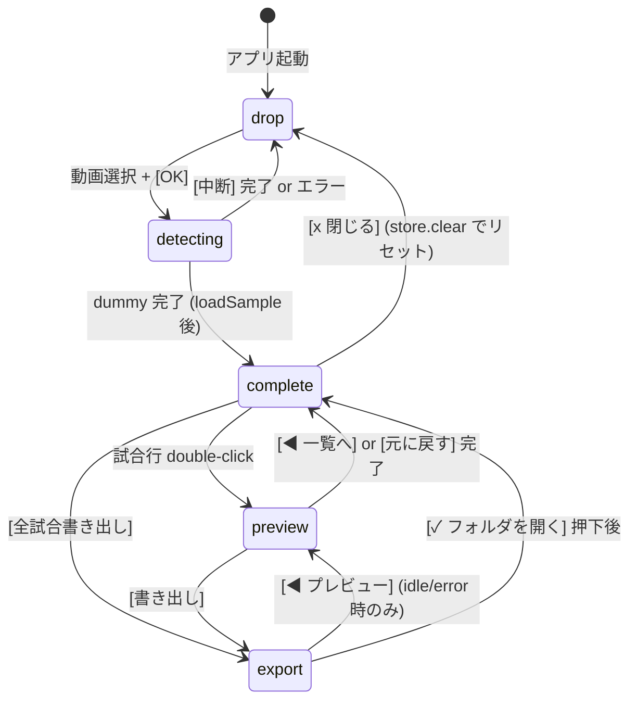
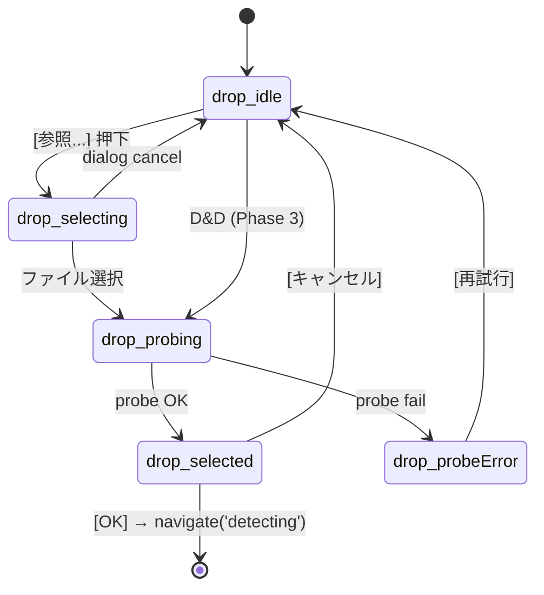
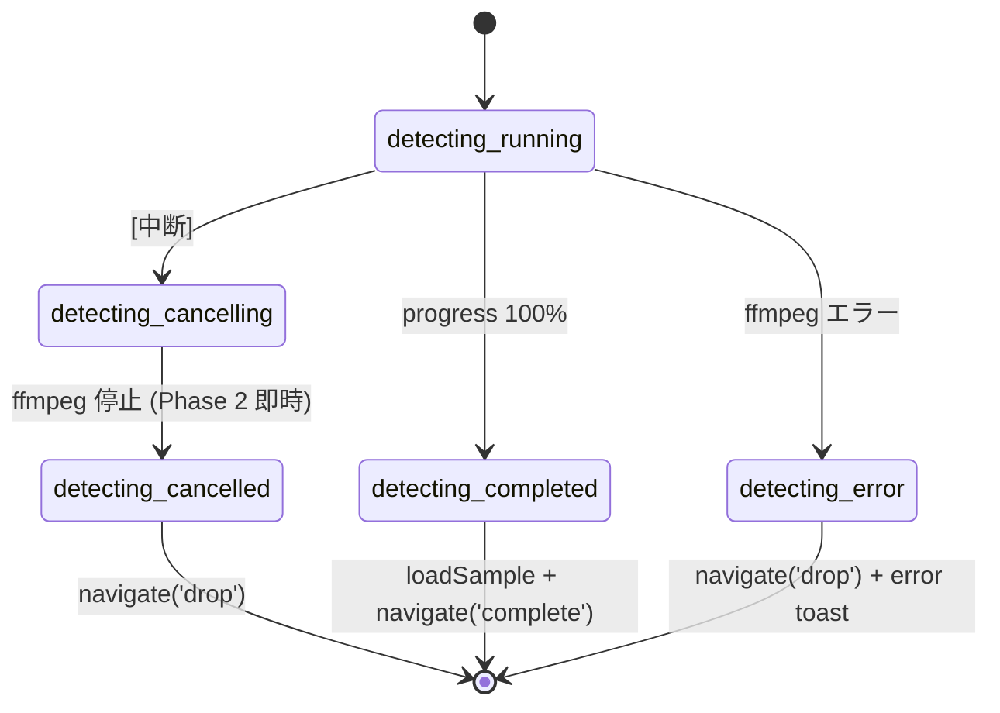
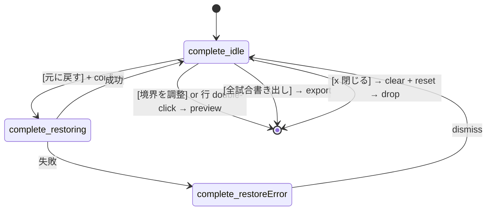
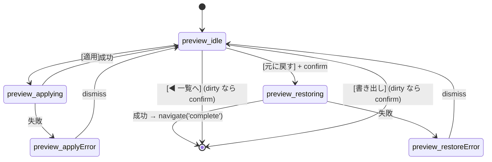
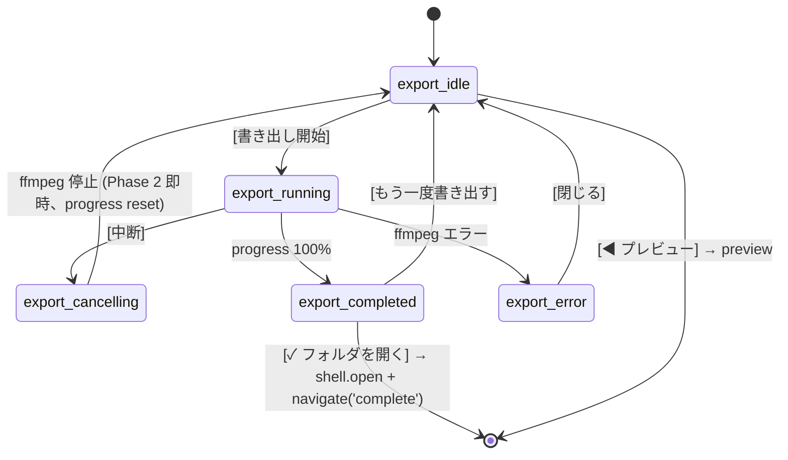
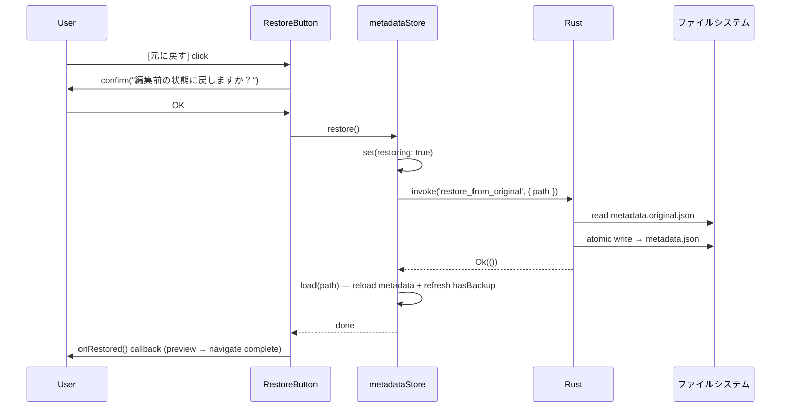

# Allagan Eye GUI — UI Architecture (Phase 2)

> **スコープ**: 本 doc は **L2a GUI (Tauri 2 + React 19) の UI 基盤のみ**を扱う。CLI (`allaganeye` サブコマンド) は [cli-spec.md](cli-spec.md)、CLI と GUI の全体構成・起動経路は [system-architecture.md](system-architecture.md) を参照。

本 doc は L2a GUI Phase 2 (#464) で確立した UI 基盤を記録する。Phase 3/4 の実装が参照する source of truth。

## 1. 概要

Phase 2 で整備した責務:

- React 19 + Zustand による 2 層 state machine (screen + phase)
- 5 画面 (drop / detecting / complete / preview / export) の UI 骨格
- `aetherTheme` デザイントークンの CSS 変数化 (`gui/src/styles/tokens.css`)
- CSS Modules による component-scoped スタイル
- `#516` `[元に戻す]` 機能 (Rust `restore_from_original` + TS `metadataStore.restore`)
- 統合テスト (flow.integration.test.tsx) + 性能目標計測

Phase 3/4 (#465, #466) は本 doc の phase 遷移を維持したまま reducer と副作用 (invoke 呼び出し) を差し替える形で実装する。

## 2. 2 層構造の state machine

```text
(a) screen   = drop | detecting | complete | preview | export   (useAppStateStore.screen)
(b) phase    = 各 screen の内部 state enum                        (screens/types.ts + local useState)
```

- **screen** は URL の代替。`useAppStateStore.navigate()` で切り替える。react-router-dom は採用しない (desktop-only)
- **phase** は画面内の状態を表現。純粋関数 `reducers/*.ts` で遷移を記述

## 3. screen 遷移図 + アプリ終了経路



**アプリ終了**: ウィンドウ右上 `×` (Tauri chrome) = 即時 app exit。任意の screen / phase から `[*]` への遷移は暗黙。Phase 2 では警告なし (dummy のため)。Phase 3/4 で running 中の confirm + process kill を追加予定 (**#523** で追跡)。

## 4. 各画面の phase state

### drop (動画ファイル選択)



- `drop_idle` 初期 — [参照...] と D&D エリア表示
- `drop_selecting` file dialog 起動中 (`@tauri-apps/plugin-dialog.open`)
- `drop_probing` ffprobe 実行中 (Phase 2 は dummy)
- `drop_selected` 成功 — ファイル情報 + [OK]/[キャンセル]
- `drop_probeError` 失敗 — error + [再試行]

Phase 3 での差し替え: `dummyProbeVideo(path)` → Rust `invoke('probe_video', { path })`。

### detecting (Phase 2 は dummy)



Phase 2 実装: 80ms interval × 100 tick で 8 秒間のダミー進捗。完了で `metadataStore.loadSample()` → navigate('complete')。Phase 3 で実 CLI stdout イベントで差し替え。

### complete



`selectedMatchIndex` は `useAppStateStore` に保持 (complete ↔ preview の往復で維持)。

**preview 遷移トリガは 2 つ**: 試合行の double-click、および上部アクションバーの `[境界を調整]` ボタン (選択中 match が無い場合 disabled)。当初は double-click のみだったが、発見性が低いという #464 レビュー指摘を受けて明示ボタンを追加。

### preview (A1 Dual IN/OUT)



Phase 2 実装:

- local state (`startT`, `endT`, `matchName`, `matchType`) は component マウント時に store から初期化
- App.tsx で `key={selectedMatchIndex}` を渡すことで、別 match を開くと PreviewScreen が再マウントされ local state が自動リセット (React 19 "avoid setState in effect" に準拠)
- [適用] は `updateMatch(...)` → `apply()` の一括処理 (local draft を store へ commit + 永続化)
- filePath が null (sampleMetadata) の場合 [適用] は disabled

Phase 3 で差し替え:

- 2 つの `<video>` placeholder を実 `<video>` + axum HTTP ストリーミングに
- `FrameStrip` を実デコードサムネイルに

### export (Phase 2 は dummy)



Phase 2 実装: 80ms interval のダミー progress。Phase 4 で実 ffmpeg 呼び出し + stderr パースに差し替え。

## 5. ffmpeg 実行中の中断フロー (Phase 3/4、#523 で実装)

Phase 2 は dummy なので `×` 即時 exit。Phase 3/4 では以下を実装 (**#523** で追跡):

1. Rust `on_window_event(CloseRequested)` で ウィンドウ閉鎖を捕捉
2. running phase (`detecting_running` / `detecting_cancelling` / `export_running` / `export_cancelling`) なら frontend へ emit
3. React で confirm ダイアログ表示
4. OK → `tokio::process::Child.kill()` → 中間ファイルクリーンアップ → app exit
5. Cancel → close request を prevent

## 6. 起動パターン

| シナリオ | 動線 | 実装 |
|---|---|---|
| 素の起動 | `drop_idle` | Phase 2 |
| 動画を [参照...] | `drop_idle → selecting → probing → selected → detecting → completed → complete` | Phase 2 (detecting/probing は dummy) |
| 動画を D&D | (Phase 3) `drop_idle → probing → selected → detecting → completed → complete` | #465 |
| argv に動画 path | (将来) | Phase 2 外 |
| 前回 metadata 自動再現 | (将来) | #517 |

## 7. ウィンドウサイズとリサイズ方針

- **初期**: 1440×900 (`gui/src-tauri/tauri.conf.json`)
- **最小**: 960×600
- **リサイズ**: `100vw` / `100vh` + `flex` で fluid 追従
  - SideRail 48px 固定、メイン領域 `flex: 1`
  - BrightnessTimeline SVG は `preserveAspectRatio="none"` で横伸縮、縦固定
  - リスト/ログは `overflow: auto`

## 8. コンポーネント階層

```text
App (App.tsx)
├── StateSwitcher           (dev 用 5 タブ、absolute 配置で右上に float)
└── body
    ├── SideRail            (ALLAGAN + 4 アイコン)
    └── main
        └── (screen === 'drop') DropScreen
        └── (screen === 'detecting') DetectingScreen
        └── (screen === 'complete') CompleteScreen
        └── (screen === 'preview') PreviewScreen (key=selectedMatchIndex で reset)
        └── (screen === 'export') ExportScreen

components/
├── AllaganCorner / AllaganFrame / AllaganSigil   (装飾)
├── SideRail / StateSwitcher                      (shell)
├── MatchThumb                                    (サムネ placeholder)
├── BrightnessTimeline                            (complete 用 SVG)
├── FrameStrip                                    (preview 用候補フレーム)
└── RestoreButton                                 (#516)

注: **カスタム title bar は無し** (prototype の WindowChrome は handoff 時点の
MacOS 風デザインだったが、L2 は Windows-only (#451) のため Tauri のネイティブ
Windows title bar に一本化。`tauri.conf.json` の `title: "Allagan Eye"` が
表示される)。

state/
├── appStateStore.ts  — screen + selectedMatchIndex + selectedVideoPath
└── metadataStore.ts  — metadata + dirty + apply / restore / loadSample

screens/reducers/
├── drop.ts       — DropEvent → DropPhase
├── detecting.ts  — DetectingEvent → DetectingPhase
└── export.ts     — ExportEvent → ExportPhase

data/
└── sampleMetadata.ts  — Phase 2 専用 sample (9 matches、AE_META 相当)

utils/
├── time.ts        — fmtTime / fmtPreciseTime
└── brightness.ts  — buildBrightnessPath / findBlackoutRegions / buildLocalBrightness
```

## 9. CSS Modules 慣例

### tokens.css の役割

`:root` に `aetherTheme` の全色・フォントを CSS カスタムプロパティとして定義:

```css
:root {
  --ae-bg: #0a0e14;
  --ae-gold: #c8a35c;
  --ae-cyan: #4ac3d9;
  --ae-font-ui: 'Cinzel', 'Trajan Pro', 'Cormorant Garamond', serif;
  /* ... */
}
```

`main.tsx` で単一 import。リサイズ基盤 (`html, body, #root { height: 100% }`) も兼ねる。

### *.module.css の命名

- クラス名は camelCase (`container`, `topBar`, `fileName`)
- base / modifier ペアは base クラスに modifier を空白区切り (`styles.button styles.buttonActive`)
- テーマ色は必ず `var(--ae-*)` 経由
- hover / transition は CSS 疑似クラスで表現 (JS 側での切替は避ける)

## 10. #516 [元に戻す] フロー



### 構成要素

- **Rust**: `restore_from_original(path) -> Result<(), String>`, `check_backup_exists(path) -> bool`
- **TS store**: `restore()`, `refreshBackupStatus()`, fields `hasBackup` / `restoring` / `restoreError`
- **UI**: `<RestoreButton>` — hasBackup=false で disabled、confirm 経由で restore 実行、`onRestored` で任意の後続処理

## 11. 性能目標

| 指標 | 目標 (Phase 2) | 計測方法 |
|---|---|---|
| 画面遷移レイテンシ (navigate → render) | <50ms (jsdom 近似) / <16ms (実 WebView 60fps 目標) | `flow.integration.test.tsx` performance section |
| 初回マウント時間 (App render → drop screen) | <250ms (jsdom) / <3s (実機) | 自動: vitest 内 / 手動: stopwatch |
| BrightnessTimeline SVG path 生成 (512 samples × 1000 iter) | <500ms 総計 | vitest ベンチ |
| 起動 → drop 画面表示 (実機) | <3s | 手動計測、PR 本文記載 |

Phase 3 で追加される目標:

- 2:50:28 録画での全操作 60fps
- preview 1 フレームシーク 200ms 以内

## 12. Phase 3/4 への引き継ぎポイント

| 場所 | Phase 2 状態 | Phase 3/4 での差し替え |
|---|---|---|
| DropScreen onDrop ハンドラ | UI のみ | #465: 動画ファイル D&D → detect 発火 |
| DropScreen dummyProbeVideo | sleep + 固定値 | #465: `invoke('probe_video', { path })` |
| DetectingScreen dummy progress | 80ms × 100 tick | #465: 実 CLI stdout イベント + event listener |
| metadataStore.loadSample | Phase 2 専用 in-memory | #465: 実 `load_metadata(generatedPath)` に差し替え |
| PreviewScreen `<MatchThumb>` | placeholder | #465: 実 `<video>` + axum HTTP + requestVideoFrameCallback |
| PreviewScreen `FrameStrip` | 疑似グラデーション | #465: 実サムネイル (ffmpeg -ss + webp) |
| ExportScreen dummy progress | 80ms interval | #466: 実 ffmpeg + stderr パース |
| ExportScreen handleOpenFolder | invoke('plugin:shell\|open') | #466 確認済動作、エラーハンドリング追加 |
| window × running 中 | 即時 exit | #523: confirm + process.kill() + cleanup |
