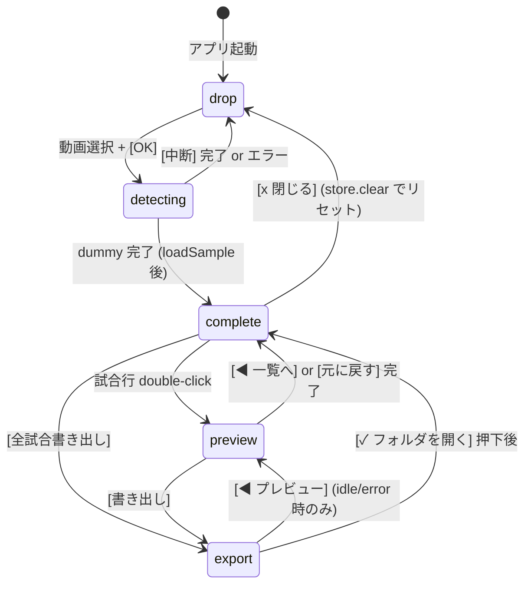
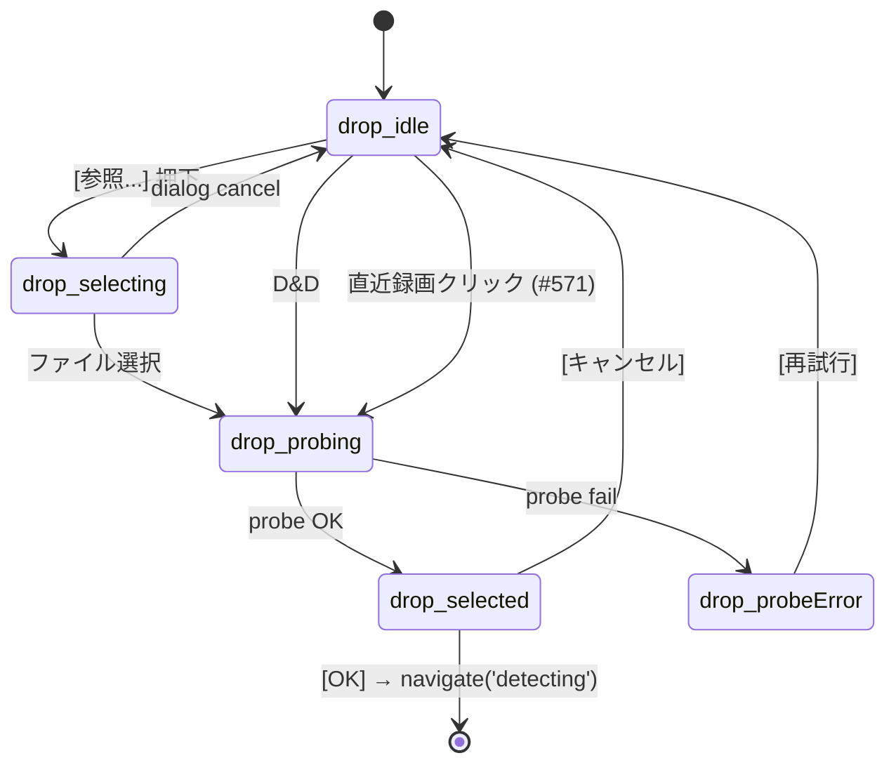
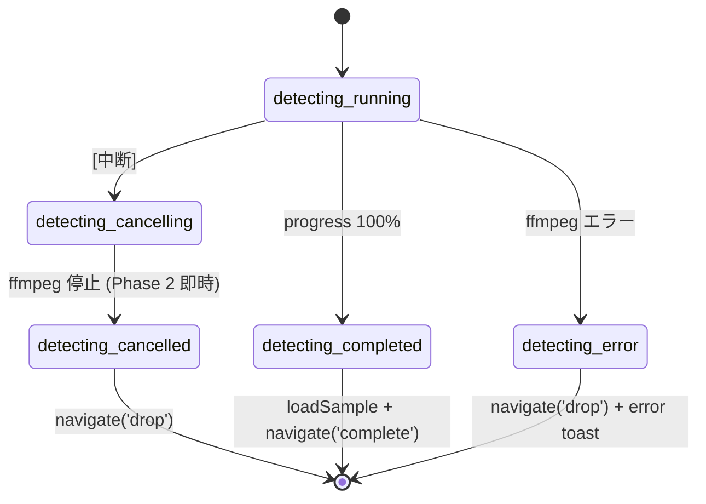
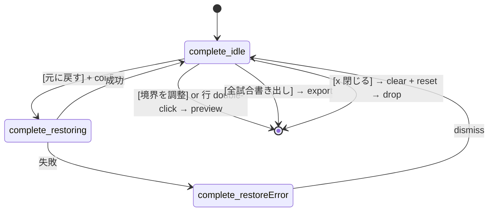
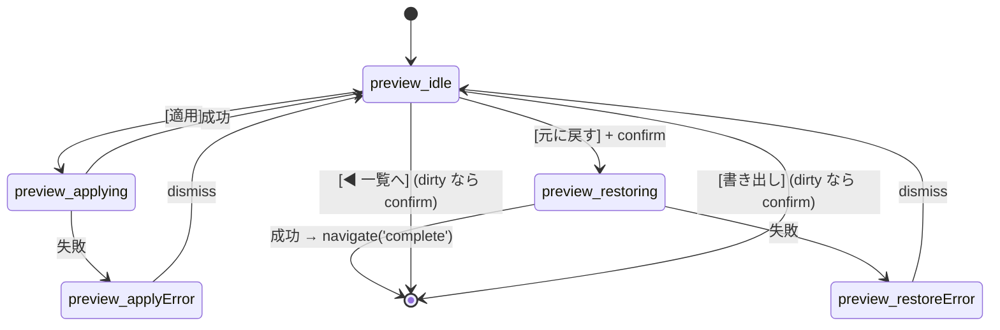
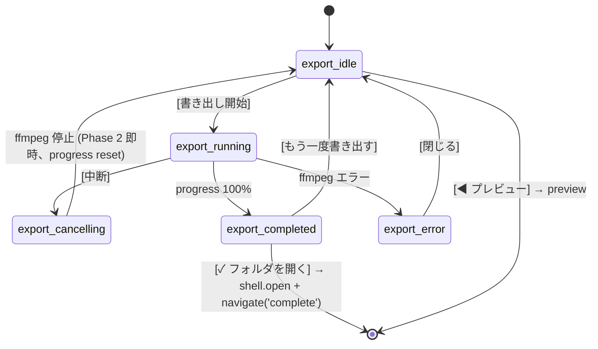
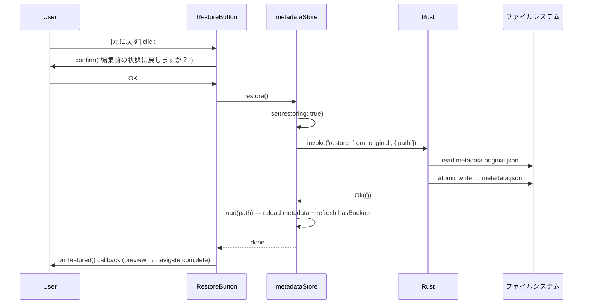

# Allagan Eye GUI — UI Architecture (Phase 2)

> **スコープ**: 本 doc は **L2a GUI (Tauri 2 + React 19) の UI 基盤のみ**を扱う。CLI (`allaganeye` サブコマンド) は [cli-spec.md](cli-spec.md)、CLI と GUI の全体構成・起動経路は [system-architecture.md](system-architecture.md)、各画面の **UI 部品ごとの操作 → 状態遷移 / store mutation / 例外処理** は [ui-interaction-spec.md](ui-interaction-spec.md) を参照。

本 doc は L2a GUI Phase 2 (#464) で確立した UI 基盤を記録する。Phase 3/4 の実装が参照する source of truth。

## 1. 概要

Phase 2 で整備した責務:

- React 19 + Zustand による 2 層 state machine (screen + phase)
- 5 画面 (drop / detecting / complete / preview / export) の UI 骨格
- `aetherTheme` デザイントークンの CSS 変数化 (`gui/src/styles/tokens.css`)
- CSS Modules による component-scoped スタイル
- `#516` `[元に戻す]` 機能 (Rust `restore_from_original` + TS `metadataStore.restore`)
- 統合テスト (flow.integration.test.tsx) + 性能目標計測

Phase 3/4 (#465, #466) は本 doc の phase 遷移を維持したまま reducer と副作用 (invoke 呼び出し) を差し替える形で実装する。

## 2. 2 層構造の state machine

```text
(a) screen   = drop | detecting | complete | preview | export   (useAppStateStore.screen)
(b) phase    = 各 screen の内部 state enum                        (screens/types.ts + local useState)
```

- **screen** は URL の代替。`useAppStateStore.navigate()` で切り替える。react-router-dom は採用しない (desktop-only)
- **phase** は画面内の状態を表現。純粋関数 `reducers/*.ts` で遷移を記述

## 3. screen 遷移図 + アプリ終了経路



**アプリ終了**: ウィンドウ右上 `×` (Tauri chrome) = 即時 app exit。任意の screen / phase から `[*]` への遷移は暗黙。Phase 2 では警告なし (dummy のため)。Phase 3/4 で running 中の confirm + process kill を追加予定 (**#523** で追跡)。

## 4. エラー伝搬フロー (#614)

GUI 内部で発生する想定外エラー (Rust panic / React 例外 / unhandled JS exception) は、ローカルログ追記 + ErrorModal 表示で集約する。Tauri command 失敗の recoverable error (例: `load_metadata` の I/O 失敗) は **既存 inline + toast UI** に流す ([ui-interaction-spec.md §1.5](ui-interaction-spec.md) 既存規約)。両者は排他で、同一画面内に重複しない。

### 経路

1. **Rust panic**
   - [`gui/src-tauri/src/error.rs`](../gui/src-tauri/src/error.rs) の `install_panic_hook` が `std::panic::set_hook` で登録
   - file write: `<install_dir>/logs/error-YYYYMMDD.log` に `PANIC_MARKER ts=... payload=... backtrace=...` を追記
   - best-effort: Tauri event `panic` を frontend に emit (WebView2 がまだ生きていれば届く)
   - 直前 panic hook (`prev_hook`) に委譲して default 動作 (process exit) を継続

2. **React 内部例外** (render / hooks / lifecycle)
   - [`gui/src/components/ErrorBoundary.tsx`](../gui/src/components/ErrorBoundary.tsx) (class component) が `componentDidCatch` で捕捉
   - `useErrorStore.showError` を呼出 (`category: 'js-error'`, `isPanic: false`, `isRecoverable: false`)
   - Boundary は `null` を render — 子 sub-tree は blank。`ErrorModal` は Boundary の **外側** ([`main.tsx`](../gui/src/main.tsx)) で render されるため、blank された後も visible

3. **unhandled JS exception / promise rejection**
   - [`gui/src/lib/globalErrorListener.ts`](../gui/src/lib/globalErrorListener.ts) が `window.addEventListener('error' / 'unhandledrejection')` で捕捉
   - `useErrorStore.showError` (`category: 'js-error' | 'js-promise'`)

4. **Tauri command 失敗** (load_metadata 等の I/O / parse failure)
   - 既存 inline + toast UI で表示 (recoverable error)
   - **ErrorModal は使わない** (二重表示回避、既存規約温存)

### ログ管理

- 場所: `<install_dir>/logs/` = アプリ実行ファイル (`allaganeye-gui.exe`) のあるフォルダ直下の `logs/` (Portable ZIP 哲学に整合 — 展開 = インストール / フォルダ削除 = アンインストール)
- panic ログ: `error-YYYYMMDD.log` (`OpenOptions::append` で自前書込、追記は単一 `write_all` 内で完結し POSIX `O_APPEND` semantics で atomic、subscriber drop 中の panic でも機能)
- 通常時 stderr: `eprintln!` (panic_hook 内の write/emit 結果、起動時 rotate / restart-detect の判定結果)。dev mode は `npm run tauri dev` の console、配布 ZIP では `cmd.exe` から起動した user に見える
- 起動時 GC: `logging::rotate_old_logs(7)` で 7 日経過 file を unlink
- 書き込み失敗 fallback: `eprintln!` warn のみで続行 (Program Files 配下展開等で write 不可なケース)

### 起動時 restart-detected

- `lib.rs::run()` 冒頭で `logging::detect_panic_from_previous_session()` を呼出し、直近 log の最終 `PANIC_MARKER` 行を検出
- `now - mtime <= 24h` のときのみ true 判定 (古い panic は alert しない)。実装の閾値は [`logging.rs::PANIC_DETECT_WINDOW_SECS`](../gui/src-tauri/src/logging.rs)。日常起動 1 度目で warning が出る自然な UX に整合させ、7 日 rotation で file 自体が消えるため「数週間前の panic を resurface」することはない
- webview ready 後 ~150ms に `panic-from-previous-session` event を emit
- `globalErrorListener` が listen して、warning ErrorModal (`isRecoverable=true / isPanic=false`) を表示

### ErrorModal の action 構成

- 「詳細をコピー」: clipboard に `{message, stack, category, timestamp}` JSON を書込
- 「ログフォルダを開く」: 既存 `open_folder_in_explorer` Tauri command 流用、`logDir` 表示
- 「Issue で報告する」link: GitHub `bug_report.yml` template への外部 link
- 「閉じる」: `isRecoverable === true` 時のみ。`dismissError()`
- 「アプリを終了」: `isPanic === true` 時のみ。既存 `force_exit_app` Tauri command 流用 (再起動 button は配置しない)

### バグ報告経路

ErrorModal は [`docs/bug-report-guide.md`](bug-report-guide.md) §1.4 の「ログ取得」と連動する。ユーザーは ErrorModal の「ログフォルダを開く」→ 該当 `.log` ファイル → issue 添付という流れで bug report を提出する。詳細手順は bug-report-guide.md を参照。

#### Issue 本文を clipboard にコピー (#669)

ErrorModal の `[Issue 本文をコピー]` button は `bug_report.yml` form 用の Markdown 本文を生成し `navigator.clipboard.writeText` で clipboard に書き込む。user は隣接の `[Issue で報告する]` link で form を別ブラウザに開いてから、`実際の動作` textarea にペーストする運用。

コピーされる本文の format ([`gui/src/lib/issueReportBody.ts`](../gui/src/lib/issueReportBody.ts) `buildIssueReportBody`):

````markdown
## 実際の動作

<errorMessage>
(stack trace がある場合)
Stack:
<errorStack>

## 環境情報

allaganeye <version> (<os_name>)
  CPU: <cpu_info>
  GPU: <gpu vendors comma-separated>
  Memory: <N> GB
  Disk: <free> / <total> GB free on <drive>

## ログファイル (末尾抜粋)

```text
<logs/error-YYYYMMDD.log の末尾 300 行>
```
````

データソース:

- `actual` ← ErrorModal の `errorMessage` + (`errorStack` があれば `\n\nStack:\n{stack}`)
- `environment` ← Tauri `probe_environment_info` で取得した OS/CPU/Memory/Disk + `metadata.system_info` の GPU vendor list を [`gui/src/lib/systemInfo.ts`](../gui/src/lib/systemInfo.ts) `formatSystemInfo()` で renders
- `log_file_attachment` ← Tauri `read_error_log_tail(line_count: 300)` で `<install_dir>/logs/error-YYYYMMDD.log` 末尾 300 行を取得 (当日 log 不存在 → 前日 fallback)

probe / log fetch が失敗してもコピー処理自体は継続する (該当 section は `(unknown)` / `(no environment info)` 等の sentinel で表示、log section は空のときに丸ごと省略)。

> **設計上の経緯**: 初期実装は `bug_report.yml` URL に query string で 3 field を pre-fill する設計だったが、PR #669 の実機検証で form が空のまま開く現象を確認した。**真の原因は `bug_report.yml` が repository default branch (`main`) に不在で template 自体がロードされておらず、`?template=bug_report.yml` URL が free-form 「Create new issue」ページに silently fallback していた点** ([#728](https://github.com/Idios/kobutachan-allaganeye/issues/728) で追跡)。GitHub Issue Forms が custom textarea field の URL pre-fill を honor するかどうかは template が rendered な状態での再検証が必要 (関連 context は [GitHub Community discussion #22335](https://github.com/orgs/community/discussions/22335) を参照)。Plan B (clipboard 経由のコピー & ペースト方式) は template 状態に依存せず動作する robust 設計のため、#728 の解決を待たずに採用した。
>
> **#458 (同意チェック新設) 着手時の調整メモ**: 本機能の body builder は現状 `actual` / `environment` / `log_file_attachment` の 3 section のみ生成する。#458 で同意必須 field (`consent`) が `bug_report.yml` form に追加された場合、Markdown body 形式での扱い (例: section として加えるべきか、form の checkbox は手動入力が前提か) を再評価する。

### AppError code 体系と inline error の使い分け (#663)

Tauri command の `Result<T, AppError>` で frontend に届く構造化 error は、
[`docs/tauri-commands.md`](tauri-commands.md) で master 一覧化されている。inline error 表示時は
`ErrorState.message` を 1 行目に、`ErrorState.hint` を 2 行目 (`var(--ae-text-dim)`)
に render する規約。code → default hint の mapping は
[`gui/src-tauri/src/error.rs`](../gui/src-tauri/src/error.rs) の `default_hint_for_code` で一元管理。

catch path では `toErrorState(e)` を 1 回呼び、結果の `ErrorState` を store の
`*ErrorState` field に set する。`ErrorState` interface (`{ message, hint, code }`) は
[`gui/src/lib/appError.ts`](../gui/src/lib/appError.ts) で定義。AppError / Error /
raw String / null/undefined を正規化した単一 `ErrorState | null` に変換する。

#### 主な分岐ルール

- `appErrorCodeIs(e, 'state.mtime_conflict')` → ConflictModal を出す (apply path のみ)
- それ以外の `code` → inline error (hint があれば `ErrorState.hint` を 2 行目に render)

### §4.7 InlineErrorHint component (#693 / #694)

PR #693 で導入された共通 component。hint UI の `💡` prefix と `var(--ae-text-dim)`
スタイルを 1 箇所に集約する。Phase 1 で 5 site (RestoreButton / DropScreen
ErrorCard / DetectingScreen / PreviewScreen / ExportScreen) + 3 site
(ConflictModal #695 / DraftRestoreModal #697 / DropScreen recentNotice #698) の
計 8 site で共有し、Phase 2 (#694) で全 store consumer が `*ErrorState` 形に
集約された後も component API (`hint: string \| null \| undefined`) は不変、
consumer 側 wrapper class での site-specific override も保持されている。

**Usage** (typical consumer pattern; store からの selector + guard 後の non-null 形):

```tsx
import { InlineErrorHint } from '../components/InlineErrorHint';

const errorState = useMetadataStore((s) => s.restoreErrorState);
// ...
{errorState && (
  <span role="alert">
    {errorState.message}
    <InlineErrorHint hint={errorState.hint} />
  </span>
)}
```

**a11y 規約**:

- consumer 側で `role="alert"` wrapper を提供する (本 component 自身は role を持たない)
- 親の role を維持することで、screen reader は「message + hint」を 1 つの alert
  update として読み上げる

**Wrapper class での site-specific override**:

- PreviewScreen `.applyErrorHint`: `display: block` で改行担保
- ExportScreen `.listErrorHint`: parent `.listError` の `nowrap` / `overflow:hidden`
  を override (`white-space: normal` + `max-width: 100%` + `overflow: visible`)
- 他 3 site (RestoreButton / DropScreen / DetectingScreen) は wrapper class 不要

### §4.8 metadataStore \*ErrorState lifecycle 規約 (#691 / #694)

各 catch path (`load()` / `runApply()` / `restore()` / `saveDraft()` / `loadDraft()`)
は自身の `*ErrorState: ErrorState | null` のみを `set` し、他経路の error state は
touch しない (案 X、PR #691 で symmetric 化)。lifecycle 終端 (`clear()` /
`loadSample()`) でのみ全 5 `*ErrorState` を null reset する。

Phase 2 (#694) で `*Error: string | null` + `*ErrorHint: string | null` の並列構造を
`*ErrorState: ErrorState | null` 単一 field に集約。型レベルで message と hint の
pair atomicity を保証し、catch path での `toErrorState(e)` 1 行 set に統一した。

この規約は `metadataStore.test.ts` の `#691: catch path lifecycle pinning`
describe block で test で pin されている。将来 catch path 追加時は同 describe
block に test を追加し、self-only 規約を継承する。

### §4.9 catch 漏れ AppError fallback (#696)

screen 側 invoke catch で受け止められなかった AppError (Promise を投げ捨て / async race / try-catch 漏れ等) は [`globalErrorListener.onUnhandledRejection`](../gui/src/lib/globalErrorListener.ts) が `isAppError(reason)` で判定し、`errorCategory: 'tauri-command'` / `errorTitle: '処理中に予期しないエラーが発生しました'` / `errorHint: reason.hint ?? null` / `isPanic: false` / `isRecoverable: true` で ErrorModal に表示する。

screen 自身の recoverable inline error UI (各 screen の local state による表示、§4.7 / §4.8) とは独立した最終 fallback として機能し、modal は `閉じる` button で dismiss 可。`errorStore` の first-write-wins 規約により、既に他カテゴリの modal が open 中であれば本 fallback は dropped される。

PR #689 (Phase 4 of #663) で `'tauri-command'` カテゴリ自体は `errorStore` の union に予約済だったが、populate 経路 (本 fallback) は #696 で追加された。

## 5. 各画面の phase state

### drop (動画ファイル選択)



- `drop_idle` 初期 — [参照...] / D&D エリア / 直近録画リスト (#571) を表示
- `drop_selecting` file dialog 起動中 (`@tauri-apps/plugin-dialog.open`)
- `drop_probing` ffprobe 実行中 (Phase 2 は dummy)
- `drop_selected` 成功 — ファイル情報 + 詳細設定パネル ([DetectionParamsPanel](../gui/src/screens/DetectionParamsPanel.tsx)、collapsible、#613) + [OK]/[キャンセル]
- `drop_probeError` 失敗 — error + [再試行]

Phase 3 での差し替え: `dummyProbeVideo(path)` → Rust `invoke('probe_video', { path })`。

詳細設定パネル (#613) で調整した値は `appStateStore.detectionParams` に保持され、`[OK]` 後の `DetectingScreen` 起動時に `toStartDetectParams` ([utils/detection.ts](../gui/src/utils/detection.ts)) で Rust `start_detect` (#569) の `params` 引数に変換されて渡る。reset() でデフォルト復帰、永続化なし (in-memory のみ)。

直近録画リスト (#571) は `<install dir>/recent.json` (Portable ZIP 哲学に揃えて exe ディレクトリ配置、PR #655 Round 2) に永続化される (Rust `read_recent` / `add_recent` / `clear_recent` Tauri command + TS `useRecentStore`)。drop / [参照…] / 直近クリックいずれの経路でも probe 成功時に `add_recent` で履歴更新 (重複は最新化、最大 10 件、`\\?\` extended-length prefix は Rust 側 `strip_extended_path_prefix` で正規化)。click 経路は `RECENT_PICKED` event 経由で `idle → probing` に遷移し、SelectedCard で確認後に detecting へ進む。物理ファイル不在 entry は `read_recent` / `add_recent` が `Path::exists()` で検出して**自動 prune** + 永続化更新 (PR #655 Round 2: 旧 grayed-out + warning notice UX を撤廃、ユーザーがリネーム / 削除した動画は次回 drop 画面表示時に消える)。

### detecting (Phase 2 は dummy)



Phase 2 実装: 80ms interval × 100 tick で 8 秒間のダミー進捗。完了で `metadataStore.loadSample()` → navigate('complete')。Phase 3 で実 CLI stdout イベントで差し替え。

### complete



`selectedMatchIndex` は `useAppStateStore` に保持 (complete ↔ preview の往復で維持)。

**preview 遷移トリガは 2 つ**: 試合行の double-click、および上部アクションバーの `[境界を調整]` ボタン (選択中 match が無い場合 disabled)。当初は double-click のみだったが、発見性が低いという #464 レビュー指摘を受けて明示ボタンを追加。

### preview (A1 Dual IN/OUT)



> 動画配信の axum HTTP server 仕様: [docs/axum-video-server.md](./axum-video-server.md)

Phase 2 実装:

- local state (`startT`, `endT`, `matchName`, `matchType`) は component マウント時に store から初期化
- App.tsx で `key={selectedMatchIndex}` を渡すことで、別 match を開くと PreviewScreen が再マウントされ local state が自動リセット (React 19 "avoid setState in effect" に準拠)
- [適用] は `updateMatch(...)` → `apply()` の一括処理 (local draft を store へ commit + 永続化)
- filePath が null (sampleMetadata) の場合 [適用] は disabled

Phase 3 で差し替え:

- 2 つの `<video>` placeholder を実 `<video>` + axum HTTP ストリーミングに
- `FrameStrip` を実デコードサムネイルに

### export (Phase 2 は dummy)



Phase 2 実装: 80ms interval のダミー progress。Phase 4 で実 ffmpeg 呼び出し + stderr パースに差し替え。

## 6. ffmpeg 実行中の中断フロー (Phase 3/4、#523 で実装)

Phase 2 は dummy なので `×` 即時 exit。Phase 3/4 では以下を実装 (**#523** で追跡):

1. Rust `on_window_event(CloseRequested)` で ウィンドウ閉鎖を捕捉
2. running phase (`detecting_running` / `detecting_cancelling` / `export_running` / `export_cancelling`) なら frontend へ emit
3. React で confirm ダイアログ表示
4. OK → `tokio::process::Child.kill()` → 中間ファイルクリーンアップ → app exit
5. Cancel → close request を prevent

## 7. 起動パターン

| シナリオ | 動線 | 実装 |
| --- | --- | --- |
| 素の起動 | `drop_idle` | Phase 2 |
| 動画を [参照...] | `drop_idle → selecting → probing → selected → detecting → completed → complete` | Phase 2 (detecting/probing は dummy) |
| 動画を D&D | `drop_idle → probing → selected → detecting → completed → complete` | #568 |
| argv に動画 path | (将来) | Phase 2 外 |
| 前回 metadata 自動再現 | (将来) | #517 |

## 8. ウィンドウサイズとリサイズ方針

- **初期**: 1440×900 (`gui/src-tauri/tauri.conf.json`)
- **最小**: 960×600
- **リサイズ**: `100vw` / `100vh` + `flex` で fluid 追従
  - メイン領域 `flex: 1` (body 全幅、旧 SideRail は #677 で削除済)
  - BrightnessTimeline SVG は `preserveAspectRatio="none"` で横伸縮、縦固定
  - リスト/ログは `overflow: auto`

## 9. コンポーネント階層

```text
App (App.tsx)
├── StateSwitcher           (dev 用 5 タブ、absolute 配置で右上に float)
└── body
    └── main
        └── (screen === 'drop') DropScreen
        └── (screen === 'detecting') DetectingScreen
        └── (screen === 'complete') CompleteScreen
        └── (screen === 'preview') PreviewScreen (key=selectedMatchIndex で reset)
        └── (screen === 'export') ExportScreen

components/
├── AllaganCorner / AllaganFrame / AllaganSigil   (装飾)
├── StateSwitcher                                 (shell)
├── MatchThumb                                    (サムネ placeholder)
├── BrightnessTimeline                            (complete 用 SVG)
├── FrameStrip                                    (preview 用候補フレーム)
├── RestoreButton                                 (#516)
└── SampleModeBanner                              (sample mode 起動時の上部 inline banner (#633))

注: **カスタム title bar は無し** (prototype の WindowChrome は handoff 時点の
MacOS 風デザインだったが、L2 は Windows-only (#451) のため Tauri のネイティブ
Windows title bar に一本化。`tauri.conf.json` の `title: "Allagan Eye"` が
表示される)。

注: **SideRail (旧 ALLAGAN + 4 装飾アイコン) は削除済** (#677、2026-05-13)。
`body` の唯一の子は `main` で、48px 帯はなくなり main が body 全幅。
`docs/design/bundle/project/variants/aether.jsx` の mock には残るが handoff
snapshot として保持しており、production 実装からは削除されている。

state/
├── appStateStore.ts  — screen + selectedMatchIndex + selectedVideoPath + detectionParams (#613)
└── metadataStore.ts  — metadata + dirty + apply / restore / loadSample

screens/reducers/
├── drop.ts       — DropEvent → DropPhase
├── detecting.ts  — DetectingEvent → DetectingPhase
└── export.ts     — ExportEvent → ExportPhase

data/
└── sampleMetadata.ts  — Phase 2 専用 sample (9 matches、AE_META 相当)

utils/
├── time.ts        — fmtTime / fmtPreciseTime
└── brightness.ts  — buildBrightnessPath / findBlackoutRegions / buildLocalBrightness
```

## 10. CSS Modules 慣例

### tokens.css の役割

`:root` に `aetherTheme` の全色・フォントを CSS カスタムプロパティとして定義:

```css
:root {
  --ae-bg: #0a0e14;
  --ae-gold: #c8a35c;
  --ae-cyan: #4ac3d9;
  --ae-font-ui: 'Cinzel', 'Trajan Pro', 'Cormorant Garamond', serif;
  /* ... */
}
```

`main.tsx` で単一 import。リサイズ基盤 (`html, body, #root { height: 100% }`) も兼ねる。

### *.module.css の命名

- クラス名は camelCase (`container`, `topBar`, `fileName`)
- base / modifier ペアは base クラスに modifier を空白区切り (`styles.button styles.buttonActive`)
- テーマ色は必ず `var(--ae-*)` 経由
- hover / transition は CSS 疑似クラスで表現 (JS 側での切替は避ける)

## 11. #516 [元に戻す] フロー



### 構成要素

- **Rust**: `restore_from_original(path) -> Result<(), String>`, `check_backup_exists(path) -> bool`
- **TS store**: `restore()`, `refreshBackupStatus()`, fields `hasBackup` / `restoring` / `restoreError`
- **UI**: `<RestoreButton>` — hasBackup=false で disabled、confirm 経由で restore 実行、`onRestored` で任意の後続処理

## 12. 性能目標

| 指標 | 目標 (Phase 2) | 計測方法 |
| --- | --- | --- |
| 画面遷移レイテンシ (navigate → render) | <50ms (jsdom 近似) / <16ms (実 WebView 60fps 目標) | `flow.integration.test.tsx` performance section |
| 初回マウント時間 (App render → drop screen) | <250ms (jsdom) / <3s (実機) | 自動: vitest 内 / 手動: stopwatch |
| BrightnessTimeline SVG path 生成 (512 samples × 1000 iter) | <500ms 総計 | vitest ベンチ |
| 起動 → drop 画面表示 (実機) | <3s | 手動計測、PR 本文記載 |

Phase 3 で追加される目標:

- 2:50:28 録画での全操作 60fps
- preview 1 フレームシーク 200ms 以内

## 13. Phase 3/4 への引き継ぎポイント

| 場所 | Phase 2 状態 | Phase 3/4 での差し替え |
| --- | --- | --- |
| DropScreen dummyProbeVideo | sleep + 固定値 | #465: `invoke('probe_video', { path })` |
| DetectingScreen dummy progress | 80ms × 100 tick | #465: 実 CLI stdout イベント + event listener |
| metadataStore.loadSample | Phase 2 専用 in-memory | #465: 実 `load_metadata(generatedPath)` に差し替え |
| PreviewScreen `<MatchThumb>` | placeholder | #465: 実 `<video>` + axum HTTP + requestVideoFrameCallback |
| PreviewScreen `FrameStrip` | 疑似グラデーション | #465: 実サムネイル (ffmpeg -ss + webp) |
| ExportScreen dummy progress | 80ms interval | #466: 実 ffmpeg + stderr パース |
| ExportScreen handleOpenFolder | invoke('plugin:shell\|open') | #466 確認済動作、エラーハンドリング追加 |
| window × running 中 | 即時 exit | #523: confirm + process.kill() + cleanup |
